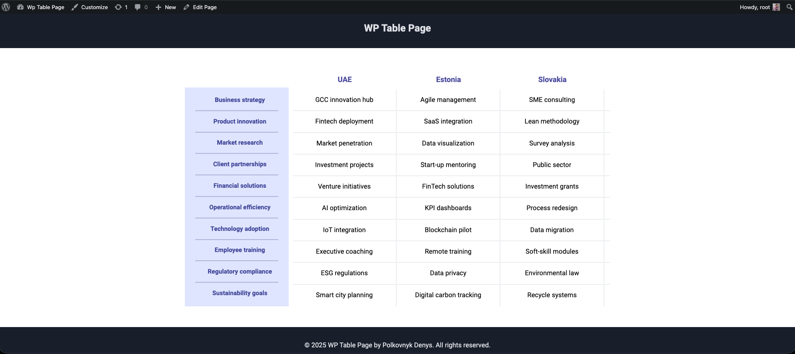
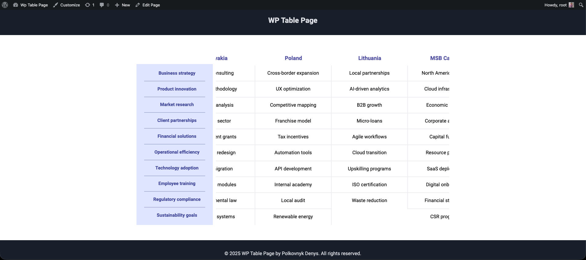
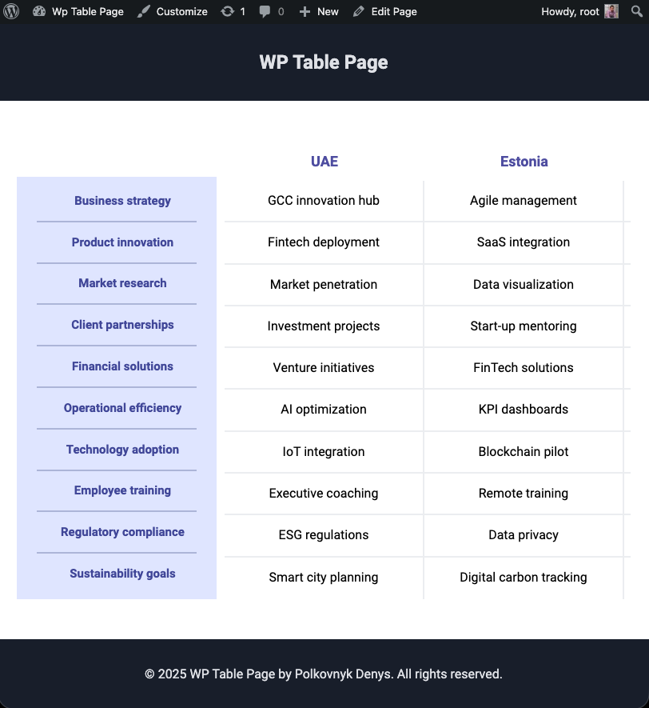
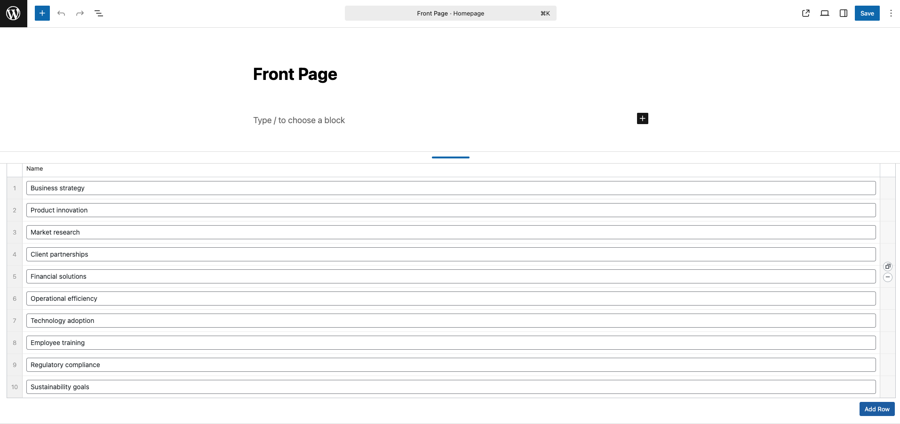
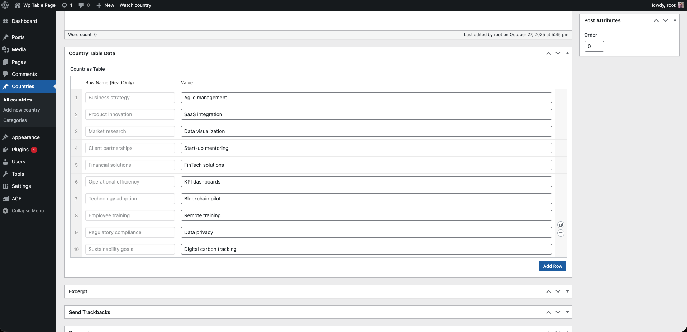

## WordPress Countries Table (Grid)

An interview/demo project for a WordPress Developer position that renders a country comparison table on the Front Page using CSS Grid (no `<table>` tag). All data is editable from the WordPress admin via Advanced Custom Fields (ACF). New rows and columns can be added from the admin UI; the layout is horizontally scrollable on smaller screens.

### Demo video

- YouTube quick overview: https://youtu.be/AvKm66QWBEE

### Key Features

- Dynamic grid table: sidebar rows on the left, country columns on the right.
- All content managed in WP Admin with ACF.
- Add any number of rows (sidebar items) and country columns.
- Simple responsive behavior with horizontal scroll for overflow.
- Dockerized local environment (WordPress + MariaDB + Adminer).

### Stack

- WordPress (classic theme)
- ACF Pro (required; licensed plugin is not included in the repository)
- Custom Post Type: `countries`
- CSS Grid + SCSS; compiled via Webpack
- Docker Compose for local dev

---

## What the test asked for

> Build a section on the home page that displays a table similar to the provided screenshot. The table consists of headers (country names), a sidebar with row names, and the main data grid. Manage countries, sidebar data, and main data from the admin. It should be possible to add new rows and columns. Provide simple responsive behavior with horizontal scrolling. Publish the code on GitHub.

This repository implements exactly that.

---

## Data model (ACF)

The project uses two ACF field groups stored as Local JSON in the theme (`wp-content/themes/wp-table-page/acf-json/`). They will appear automatically in ACF and can be synced if needed.

1. Front Page group: “Table Structure”

- Field: `table_rows` (repeater)
  - `row_id` (text): machine ID for a row (e.g. `row_1`)
  - `row_name` (text): human-friendly label shown in the left sidebar

Location: by default it is bound to a specific page ID (see Notes). You can switch it to “Front Page” in ACF if you prefer.

2. Countries group: “Country Table Data” (post type `countries`)

- Field: `country_table` (repeater)
  - `row_id` (custom ACF field type `sync-rows`, read-only): displays row names in the same order as on the Front Page, so editors can see which row they are filling
  - `row_value` (text): the value for this country and this row

Custom ACF field type

- File: `wp-content/themes/wp-table-page/modules/acf_extra_fields/fields/acf_sync_rows.php`
- Purpose: show the corresponding row name from the Front Page next to each editable value, keeping the order in sync and preventing manual edits of the row name in country posts.

Custom post type

- File: `wp-content/themes/wp-table-page/includes/theme-post-types.php`
- CPT key: `countries` (each post is a country/column).

---

## Rendering (frontend)

Files of interest:

- Template section: `wp-content/themes/wp-table-page/template-parts/sections/front-page-section.php`
  - Loads: country IDs and sidebar rows via helpers.
- Grid markup: `wp-content/themes/wp-table-page/template-parts/partials/front-table.php`
  - Receives: `countries_ids` (array of post IDs) and `sidebar_rows` (array of strings)
  - Renders a CSS Grid with one fixed left column (sidebar) and N country columns.
- Cell/column micro partials: `template-parts/micro-partials/`
- Styles: `src/scss/partials/table.scss` → compiled to `dist/css/front-page.css`

Behavior

- The left sidebar shows the row names from the Front Page repeater (one per row).
- Each country column shows values from its `country_table` repeater, matched by index/order.
- The grid scrolls horizontally on smaller screens.

---

## Screenshots

Front-end grid (desktop):


Additional screenshots (located in `screenshots/`):











Optional (add your own images to `docs/` and keep the same names):

- Admin — Front Page rows (ACF): `docs/admin-front-page.png`
- Admin — Country table values (ACF): `docs/admin-country.png`

If you add these files, they will be displayed here automatically:


---

## Local development (Docker)

Prerequisites

- Docker and Docker Compose installed

Start the stack

```bash
docker-compose up -d
```

Services

- WordPress: http://localhost:8080
- Adminer (DB UI): http://localhost:8082

Database credentials (see `docker-compose.yml`)

- Host: db
- DB: wordpress
- User: root
- Password: root

Stop the stack

```bash
docker-compose down
```

---

## First-time setup in WP Admin

1. Install and activate ACF Pro

- ACF Pro is a paid plugin and is not included in this public repository.
- Upload and activate “Advanced Custom Fields PRO”. The custom field type will register automatically.

2. Sync ACF field groups (if prompted)

- ACF will detect local JSON and suggest syncing.

3. Create or set the Front Page

- Create a page and set it as the site Front Page in Settings → Reading.
- In ACF, open “Table Structure” and adjust the Location rule if needed (e.g. bind to “Front Page” instead of a hardcoded Page ID). Then fill `table_rows` with the desired rows.

4. Create countries

- Add posts in the “Countries” post type. The “Countries Table” repeater will show a read-only row name for guidance and an editable value field per row.

5. Visit the Front Page

- You should see the grid table rendered. Add more rows or countries at any time.

---

## Building assets

Assets are already compiled in `dist/`. If you change SCSS/JS, rebuild:

```bash
cd developer/wp-content/themes/wp-table-page
npm install
npm run dev    # or: npm run prod
```

Output will be written to `dist/` (CSS, JS, fonts, images). The theme includes `dist/scripts.php` to enqueue assets.

---

## Project structure (high level)

```
wp-table-page/
├─ docker-compose.yml                 # Docker stack (WP + MariaDB + Adminer)
└─ developer/                         # Full WordPress project root
   └─ wp-content/themes/wp-table-page/
      ├─ acf-json/                    # Local JSON for ACF field groups
      ├─ modules/acf_extra_fields/    # Custom ACF field: sync-rows
      ├─ template-parts/              # Sections, partials, micro-partials
      ├─ src/                         # SCSS/JS sources
      ├─ dist/                        # Compiled assets
      ├─ includes/                    # Helpers, CPT, queries
      └─ front-page.php               # Front page template
```

---

## Notes & limitations

- ACF Pro is required and must be supplied by you (license restrictions).
- The “Table Structure” field group in `acf-json` may be bound to a specific page ID. If your Front Page has a different ID, open the field group in ACF and change its Location rule to “Front Page” (recommended) or to your page.
- The read-only row label in country posts is rendered by the custom field type and follows the order from the Front Page. Editors only input the values.

---

## License

MIT — see `developer/wp-content/themes/wp-table-page/package.json`.
